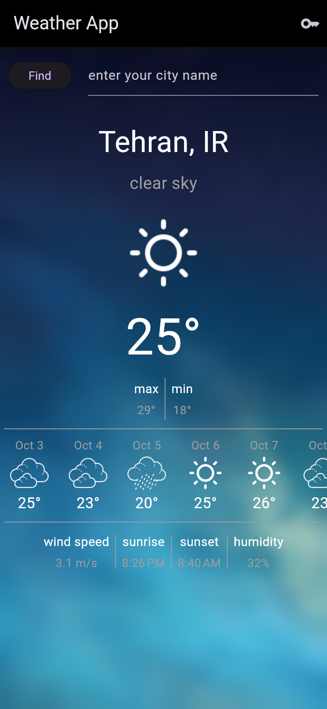
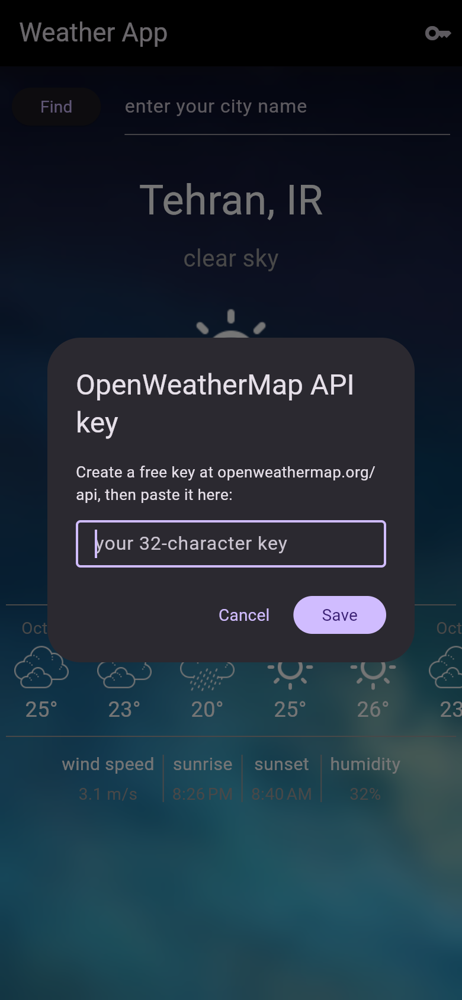

<div align="center">

# 🌦️ Weather

**Current conditions + a 7-day forecast, powered by the OpenWeatherMap API.**

[](https://flutter.dev)
[](https://dart.dev)
[](https://pub.dev/packages/dio)
[](LICENSE)

</div>

---

## 📲 Try it · امتحانش کنید

| 🤖 **Android APK** · نسخهٔ اندروید | **[Latest release](https://github.com/ParsaFathii/weather/releases/latest)** — download `app-release.apk` · فایل `app-release.apk` را دانلود کنید |
| 🔑 **Free API key** · کلید رایگان | The app asks for your own OpenWeatherMap key on first launch (or via the key button) — create one for free at [openweathermap.org/api](https://openweathermap.org/api) · اپ کلید OpenWeatherMap شما را می‌پرسد؛ رایگان از سایت بگیرید |

---

## 📸 Screenshots · اسکرین‌شات‌ها

<p align="center">
  
  
</p>

---

## 🇬🇧 English

My first app that talks to a **real REST API**: search any city and get its current temperature, condition, min/max, wind speed, humidity, sunrise/sunset — plus a horizontal 7-day forecast strip.

This repository is also a small case study in **reviving broken code**. The original version could never actually work, and this repo now documents what was wrong and how it was fixed:

### 🩺 Bugs found & fixed

| # | Bug | Fix |
|---|-----|-----|
| 1 | Request URL had a typo: `/data/2.5/weatherr` (double *r*) → API always 404'd | Corrected endpoint in `open_weather_service.dart` |
| 2 | JSON keys misspelled: `weather[0]['maim']`, `['describtion']` → parse always crashed | Corrected to `main` / `description` |
| 3 | Search field used a throw-away `TextEditingController`, so the "Find" button always read an **empty** string | Single controller, wired to the field and disposed |
| 4 | `lat`/`lon` were never assigned from the response, and were swapped between call site and function | Coordinates flow: current weather → forecast request |
| 5 | The forecast request was fired from inside `build()` on every rebuild | Chained once per load, errors surface via SnackBar |
| 6 | `progress_indicators` package is incompatible with Dart 3 → `pub get` failed | Replaced with a built-in animated `JumpingDots` widget |
| 7 | API key hard-coded in source (in a public repo!) | Key supplied at runtime via `--dart-define` **or the in-app key dialog** (stored with `shared_preferences`) |
| 8 | Sunrise/sunset parsed with `fromMicrosecondsSinceEpoch` (1000× off) | `fromMillisecondsSinceEpoch(..., isUtc: true).toLocal()` |

### ✨ What's inside

| Concept | Where it lives |
|---|---|
| REST client with `dio` (injectable for tests) | `lib/services/open_weather_service.dart` |
| Typed models with `fromJson` factories | `lib/model/` |
| `FutureBuilder` + `StreamBuilder` composition | `lib/screens/home.dart` |
| Blurred image background, RTL-friendly layout | `lib/screens/home.dart` |
| Custom animated loading indicator (no external package) | `lib/screens/home.dart` |
| Unit tests with a fake `HttpClientAdapter` — URL, params & parsing verified | `test/widget_test.dart` |

### 🔑 API key

The app needs a free [OpenWeatherMap](https://openweathermap.org/api) key. It is **never stored in source** — pass it at run time:

```bash
flutter run --dart-define=OPENWEATHER_API_KEY=<your_key>
```

### 🚀 Run it

```bash
flutter pub get
flutter run --dart-define=OPENWEATHER_API_KEY=<your_key>
```

No key at build time? No problem — the app now has an **in-app key dialog**
(key icon in the app bar): paste your free OpenWeatherMap key there, it is
stored on-device and survives restarts. That is also what makes the
downloadable APK usable by anyone.

### 🧪 Test it

```bash
flutter test
```

---

## 🇮🇷 فارسی

اولین اپی که با یک **REST API واقعی** کار می‌کند: هر شهری را جست‌وجو کنید تا دمای فعلی، وضعیت هوا، کمینه/بیشینه، سرعت باد، رطوبت و طلوع/غروب آفتاب را به‌همراه نوار افقی پیش‌بینی ۷ روزه ببینید.

این ریپو همچنین یک مطالعهٔ موردی کوچک دربارهٔ **احیای کد خراب** است. نسخهٔ اولیه هرگز نمی‌توانست کار کند و این ریپو الان مستند می‌کند چه چیزهایی اشتباه بود و چگونه درست شد (جدول بالا — ۸ باگ واقعی از آدرس اشتباه API تا کلید هاردکدشده در سورس عمومی).

### 🔑 کلید API

اپ به یک کلید رایگان [OpenWeatherMap](https://openweathermap.org/api) نیاز دارد که **هرگز در سورس ذخیره نمی‌شود** و موقع اجرا پاس می‌شود:

```bash
flutter run --dart-define=OPENWEATHER_API_KEY=<کلید_شما>
```

### ✨ چه چیزهایی در آن هست

| مفهوم | محل استفاده |
|---|---|
| کلاینت REST با `dio` (قابل تزریق برای تست) | `lib/services/open_weather_service.dart` |
| مدل‌های تایپ‌شده با `fromJson` | پوشهٔ `lib/model/` |
| ترکیب `FutureBuilder` و `StreamBuilder` | `lib/screens/home.dart` |
| پس‌زمینهٔ تصویری با بلور | `lib/screens/home.dart` |
| اندیکیتور انیمیشنی داخلی بدون پکیج بیرونی | `lib/screens/home.dart` |
| تست واحد با `HttpClientAdapter` ساختگی | `test/widget_test.dart` |

### 🚀 اجرا

```bash
flutter pub get
flutter run --dart-define=OPENWEATHER_API_KEY=<کلید_شما>
```

کلید ندارید؟ مشکلی نیست — اپ الان یک **دیالوگ درون‌برنامه‌ای برای وارد کردن کلید**
دارد (آیکون کلید در نوار بالا): کلید رایگان OpenWeatherMap خود را همان‌جا بچسبانید؛
روی دستگاه ذخیره می‌شود و بعد از بستن اپ هم می‌ماند. همین قابلیت باعث می‌شود
فایل APK قابل دانلود برای هر کسی قابل استفاده باشد.

---

<div align="center">

**Built with Flutter · Maintained by [Parsa Fathi](https://github.com/ParsaFathii)**

</div>
